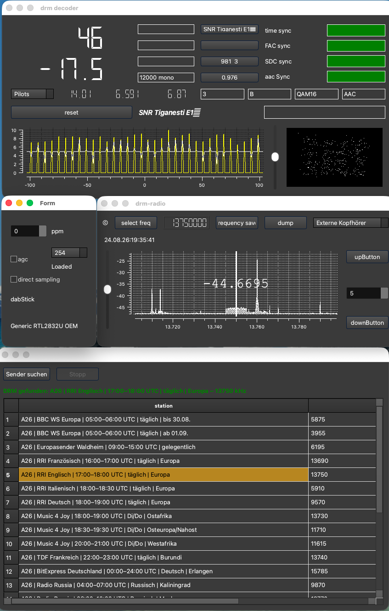

# drm-receiver on macOS (Apple Silicon and Intel)

> **Unofficial community port/build guide**

Native macOS build notes and helper scripts for running
[`JvanKatwijk/drm-receiver`](https://github.com/JvanKatwijk/drm-receiver)
on Apple Silicon (`arm64`) and Intel (`x86_64`) Macs. The verified radio
test used an RTL-SDR Blog V4 on Apple Silicon.

The helper creates a machine-local native build. It is not a redistributable
application bundle: Qt and the other libraries remain provided by Homebrew on
the Mac that performs the build.

## Verified real-world DRM reception

This procedure was developed and radio-tested on an **Apple M4 Mac** with
native ARM64 Homebrew libraries. The generic helper also contains the native
Intel build path; that path still needs real Intel-Mac verification.

The resulting application:

- built as **ARM64 native** (`translated: false`)
- launched successfully with Qt 6 / Qwt
- loaded `librtlsdr.dylib` on macOS
- detected an **RTL-SDR Blog V4 / R828D**
- received HF through the RTL-SDR path
- achieved complete DRM synchronization
- successfully decoded DRM audio
- identified **BBC World Service** during an earlier marginal-signal test
- identified **QAM16 / xHE-AAC**
- successfully received **Radio Romania International (RRI)** on **13,750 kHz**
- successfully reached **Time, FAC, SDC and AAC synchronization**
- successfully tested the experimental stored-station scanner

### Radio Romania International test

A real-world reception test of **Radio Romania International (RRI)** on
**13,750 kHz** achieved complete DRM synchronization:

- Time sync ✅
- FAC sync ✅
- SDC sync ✅
- AAC sync ✅
- SNR: ~17.4 dB
- QAM16
- AAC audio
- 12 kHz mono

The station was automatically detected from the stored DRM station list using
the experimental station scanner.



*Successful real-world DRM reception on Apple Silicon using an RTL-SDR Blog V4.*

An earlier test also successfully identified **BBC World Service** and
**xHE-AAC**, with brief decoded audio under marginal reception conditions.

This demonstrates real-world DRM reception and decoding rather than merely
a successful compilation of the application.

## Important scope note

`drm-receiver` is an upstream GPL-2.0 project. This repository does **not** relicense it and does not claim official macOS support.

The helper script clones upstream source, applies a small set of macOS
compatibility edits locally, and builds it against the current Mac's native
Homebrew libraries.

## Tested environment

```text
Hardware:       Apple Silicon M4
Architecture:   arm64
macOS:          26.5.2
Qt:             6.11.1
Qwt:            6.3.0
FDK-AAC:        2.0.3
librtlsdr:      2.0.3
Homebrew:       native ARM64 (/opt/homebrew)
```

Upstream commit used during the successful porting session:

```text
ca8e7e06bb88a200365f908b680735587165d669
```

## Requirements

- a Mac running macOS
- native Homebrew for the current architecture
- internet access for Homebrew and the upstream clone
- Xcode Command Line Tools

Do not run an Intel Homebrew under Rosetta on Apple Silicon. The helper rejects
the usual mismatched `/usr/local` and `/opt/homebrew` combinations rather than
silently producing a mixed-architecture build.

## Quick build

```bash
chmod +x build_drm_receiver_macos.sh
./build_drm_receiver_macos.sh
```

By default the helper uses:

```text
~/drm-receiver
```

To use another source directory:

```bash
DRM_RECEIVER_SRC="$HOME/src/drm-receiver" ./build_drm_receiver_macos.sh
```

The previous Apple-Silicon command remains available as a compatibility entry
point:

```bash
./build_drm_receiver_macos_arm64.sh
```

It delegates to the generic helper and refuses to run in an Intel process.
The helper intentionally does **not** use `sudo`.

## What the helper changes

The tested upstream source was strongly Linux-oriented in a few places. The helper applies these local compatibility fixes:

1. Detects `arm64` or `x86_64` and resolves all dependencies through the active native Homebrew installation.
2. Adds the detected include/library paths for Qt 6, Qwt, libsndfile, libsamplerate, PortAudio, libusb, FFTW, Eigen, FDK-AAC and librtlsdr.
3. Changes `#include <QwtText>` to `#include <qwt_text.h>` for Homebrew Qwt.
4. Removes Linux-oriented linker assumptions such as `-lfaad_drm`, `-lqwt-qt6`, `-lrt`, `-ldl`, `-L/usr/lib64` and `-L/lib64` on macOS.
5. Links Qwt as a macOS framework.
6. Adds a macOS RTL-SDR runtime loader using the path reported by `brew --prefix librtlsdr` on the build machine.
7. Uses the local macOS version as the default deployment target, avoiding a false promise of compatibility with an older system than the installed Homebrew libraries support.
8. Verifies that the resulting executable contains the current Mac architecture.

## Build output

Find the generated app with:

```bash
find ~/drm-receiver/build-"$(uname -m)" -maxdepth 7 \
  \( -name "drm-receiver.app" -o -name "drm-receiver" \) -print
```

A path observed during testing was:

```text
~/drm-receiver/build-arm64/linux-bin/drm-receiver.app
```

Launch from Terminal for diagnostics:

```bash
~/drm-receiver/build-"$(uname -m)"/linux-bin/drm-receiver.app/Contents/MacOS/drm-receiver
```

## RTL-SDR Blog V4 notes

Before selecting the `dabstick` backend, close SDR++, Gqrx, welle.io, `rtl_test`, or any other program that may already own the SDR.

A busy device may produce:

```text
usb_claim_interface error -3
Opening dabstick failed
```

Verify the stick independently with:

```bash
rtl_test -t
```

A working Blog V4 should report:

```text
Found Rafael Micro R828D tuner
RTL-SDR Blog V4 Detected
```

Stop `rtl_test` before opening `drm-receiver`.

## HF / DRM reception

For shortwave DRM, the tested receiver exposed a **direct sampling** option in the RTL-SDR control window.

A real DRM lock progresses through:

```text
time sync
FAC sync
SDC sync
aac Sync
```

During the verified BBC test, the decoder displayed:

```text
BBC WS
BBC World Service
QAM16
xHE-AAC
```

and produced brief decoded audio.

Weak DRM can show green time/FAC sync while SDC/AAC remain intermittent.

## Troubleshooting

See [`docs/TROUBLESHOOTING.md`](docs/TROUBLESHOOTING.md).

## Patch documentation

See [`patches/README.md`](patches/README.md).

## Licensing

This repository uses **GNU GPL version 2** for compatibility with the upstream project.

`drm-receiver` itself remains copyright its upstream authors/contributors and remains governed by its upstream **GPL-2.0** terms.

This is an unofficial community project and is not affiliated with or endorsed by the upstream maintainer. Third-party dependencies remain governed by their own licenses.

## Status

```text
Native ARM64 build       VERIFIED
Native Intel build       IMPLEMENTED, NOT HARDWARE-VERIFIED
Qt GUI                    VERIFIED
RTL-SDR Blog V4           VERIFIED
HF input                  VERIFIED
DRM time/FAC sync         VERIFIED
BBC World Service ID      VERIFIED
xHE-AAC identification    VERIFIED
Decoded audio             VERIFIED BRIEFLY
Long-term stable decode   NOT YET CLAIMED
```
